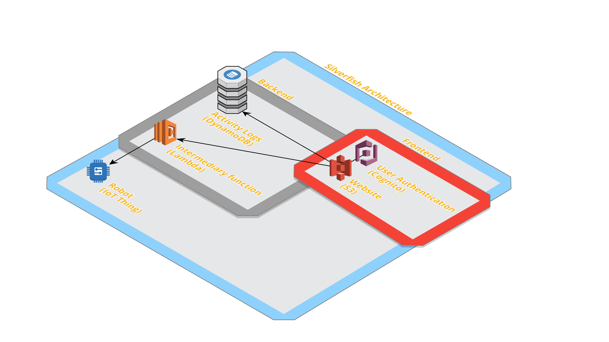

# silverfish

Web interface for controlling a robot

# contributors

Alex Brooke brookea@purdue.edu

# technology

This project will use Amazon Web Services in a few ways:

- An AWS bucket will host the webpage responsible for providing users with control of the robot
  - The webpage will be written in HTML and JavaScript
  - It will start with a login prompt, and each user will have a limited time during which they will be able to control the robot (interval TBD)
  - The user interface will have a few buttons representing actions the robot will be able to take
- An AWS DynamoDB instance will log the actions users have sent to the robot
- AWS Cognito will handle user authentication
- An AWS Lambda will act as the "server" for the interface, sending relevant data to the robot
- An AWS IoT Thing will act as the ultimate intermediary between the internet and the robot

